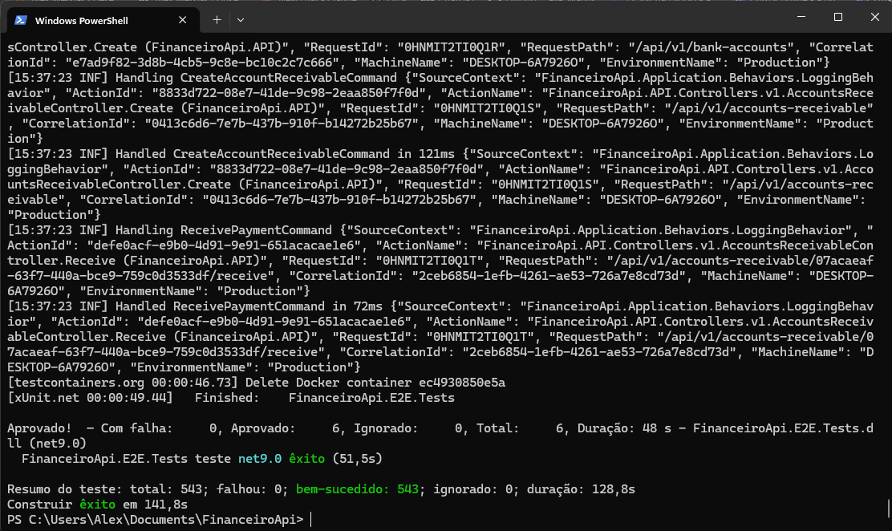

# FinanceiroApi

Sistema de gestão financeira e contábil completo, construído com .NET 9 seguindo Clean Architecture, CQRS e Domain-Driven Design. Cobre contas a pagar/receber, folha de pagamento, contabilidade em partidas dobradas, conciliação bancária, orçamentos, controle de acesso por papéis e relatórios gerenciais.

> Este é o backend (API). O frontend está em [`financeiro-web`](../financeiro-web).

## ✨ Principais funcionalidades

- **Contabilidade completa**: Plano de Contas, Períodos Contábeis, Lançamentos (manuais e automáticos via Domain Events), Balancete de Verificação, com validação de partida dobrada
- **Financeiro**: Contas a Pagar/Receber, Transações, Orçamentos, integração automática com a contabilidade ao confirmar pagamentos/recebimentos
- **Bancário**: múltiplas Contas Bancárias, Importação de Extratos, **Conciliação Bancária completa** (criação, vinculação de itens do extrato a transações, finalização com validação de pendências)
- **RH**: Departamentos, Funcionários, Folha de Pagamento com cálculo de INSS/IRPF e fluxo de aprovação (Processar → Aprovar → Pagar)
- **Fiscal**: Obrigações e Pagamentos de Impostos (ICMS, ISS, INSS, FGTS, etc.)
- **Relatórios**: Resumo Financeiro, Balancete de Verificação
- **Gestão de Usuários e Controle de Acesso (RBAC)**: 3 níveis de acesso (Employee/Manager/Admin), proteção de rotas por papel, alteração de nível/ativação de usuários e **log de auditoria** completo de todas as alterações administrativas

## 🛠️ Stack

- **.NET 9** — Clean Architecture (Domain / Application / Infrastructure / API)
- **CQRS + MediatR** — separação de Commands e Queries, com pipeline behaviors de validação e logging
- **PostgreSQL** + Entity Framework Core 9
- **Redis** — cache de queries
- **RabbitMQ** — mensageria assíncrona
- **FluentValidation** — validação de comandos
- **AutoMapper** — mapeamento entidade → DTO
- **JWT** — autenticação, com `JsonStringEnumConverter` (enums trafegam como string) e níveis de acesso aplicados via Policies
- **xUnit + NSubstitute + FluentAssertions + Testcontainers** — testes unitários, de integração (com PostgreSQL real via container) e E2E
- **Docker Compose** — orquestração completa do ambiente

## 🏗️ Arquitetura

```
src/
├── FinanceiroApi.Domain/          # Entidades, Value Objects, Domain Events, Interfaces
├── FinanceiroApi.Application/     # Commands, Queries, Handlers, DTOs, Validators
├── FinanceiroApi.Infrastructure/  # EF Core, Repositórios, Configurações, Migrations
├── FinanceiroApi.CrossCutting/    # Constantes, Segurança, Cache, Notificações, Paginação
└── FinanceiroApi.API/             # Controllers, Middlewares, Program.cs
```

Padrões aplicados: Repository, Unit of Work, Domain Events (para efeitos colaterais como geração automática de lançamentos contábeis e log de auditoria de usuários), Notification Pattern (em vez de exceptions para erros de validação de negócio).

## 🚀 Como rodar

### Pré-requisitos
- Docker e Docker Compose
- (Opcional, para desenvolvimento local fora do Docker) .NET 9 SDK

### Configuração do ambiente

Copie o arquivo de exemplo e gere uma chave JWT própria:

```bash
cp .env.example .env
```

Gere uma `JWT_SECRET` forte (PowerShell):
```powershell
$rng = New-Object System.Security.Cryptography.RNGCryptoServiceProvider
$bytes = New-Object byte[] 32
$rng.GetBytes($bytes)
[Convert]::ToBase64String($bytes)
```

Cole o valor gerado no `.env` (campo `JWT_SECRET`). **O `.env` nunca é commitado** — o `appsettings.json` e o `docker-compose.yml` versionados contêm apenas placeholders não-funcionais.

### Subindo o ambiente completo

```bash
docker compose up -d --build
```

Isso sobe: API (`:8080`), PostgreSQL, Redis, RabbitMQ, e aplica as migrations automaticamente.

### Populando dados de demonstração

Com o banco já migrado e vazio, aplique o seed:

```bash
docker exec -i financeiroapi-postgres psql -U financeiro -d financeirodb < database/seed.sql
```

Isso popula: período contábil, plano de contas, centros de custo, fornecedores, clientes, contas a pagar/receber, orçamento, obrigações fiscais, contas bancárias com extratos, conciliação bancária de exemplo, departamento, funcionários, lançamentos contábeis e o usuário administrador de demonstração.

> O script trata automaticamente a referência circular de auto-relacionamento em `ChartOfAccounts`/`CostCenters` (hierarquia pai-filho) e roda dentro de uma transação única.

### Acessando a documentação interativa (Scalar)

```
http://localhost:8080/scalar/v1
```

## 🔑 Conta de demonstração

| Campo | Valor |
|---|---|
| E-mail | `admin@financeiro.com` |
| Senha | `Admin@123` |
| Nível | Administrador (acesso completo) |

> Essa conta é protegida no nível de aplicação contra alteração de nome, senha, nível de acesso e desativação — garantindo que a demonstração sempre funcione para qualquer visitante, mesmo que outro administrador tente alterá-la.

## 🔐 Níveis de acesso (RBAC)

| Nível | Permissões |
|---|---|
| **Employee** | Acesso completo às áreas operacionais (Banco, Contabilidade, Financeiro, Cadastros, Fiscal, Relatórios) |
| **Manager** | Tudo do Employee + módulo de RH (Departamentos, Funcionários, Folha de Pagamento) |
| **Admin** | Tudo do Manager + Gerenciamento de Usuários (alterar nível, ativar/desativar, log de auditoria) |

Controle aplicado tanto via `[Authorize(Policy = "RequireManager"/"RequireAdmin")]` nos endpoints quanto via proteção de rotas no frontend.

## 🧪 Testes

<p align="center">
  
</p>

```bash
dotnet test
```

**543 testes, 100% passando**, distribuídos em:
- **Domain.Tests** (322) — regras de negócio e invariantes das entidades
- **Application.Tests** (204) — handlers de commands/queries com mocks via NSubstitute
- **Integration.Tests** (11) — fluxos completos com PostgreSQL real via Testcontainers
- **E2E.Tests** (6) — principais jornadas de ponta a ponta

## ⚠️ Notas e limitações conhecidas

- Projeto desenvolvido para fins de portfólio — gere sua própria `JWT_SECRET` via `.env` em qualquer ambiente (nunca reutilize valores de exemplo)
- O endpoint de Lançamentos Contábeis não usa paginação tradicional por escolha de design: ele exige um Período Contábil (que naturalmente limita o volume de registros), em vez de paginação genérica
- Alguns recursos (Plano de Contas, Períodos Contábeis) usados como seletores em formulários esperam um `pageSize` maior explícito do consumidor para evitar corte de opções
